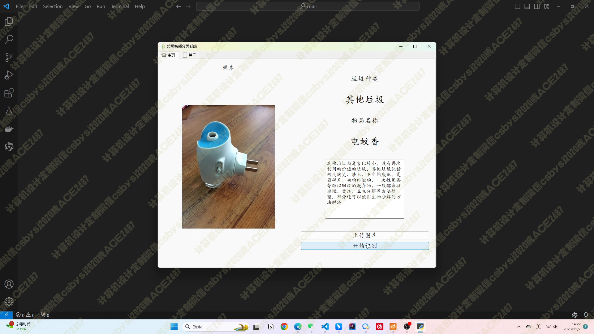

# 037 基于 CNN 的智能垃圾分类系统-设计展示

> **代码有偿获取 可接受定制 微信联系方式: csbysj2020 或 ACE2487，备注(BS)**

> 

> 

## 介绍

这个智能垃圾分类系统是基于 Python、PyQT5、TensorFlow 等技术栈构建而成的。系统主要通过 TensorFlow 训练两组模型来执行垃圾分类任务，其中包括一个 CNN 模型和一个 MobileNet 模型。数据集经过事先的清洗，包含了 4 个大类和 245 个小类的垃圾图片，以便更精确地进行分类。

在训练过程中，两个模型分别使用 train_cnn.py 和 train_mobilenet.py 进行训练。训练完成后，系统提供了图形化界面，利用 PyQT5 实现，用户可以通过上传图片来获取垃圾的具体种类。

该系统还包括了一些辅助功能，比如测试文件 testmodel.py 用于验证两组模型在验证集上的准确率，并通过 results 目录下的可视化图表展示训练过程中的准确率和损失变化曲线。

总的来说，这个系统将为用户提供一个方便快捷的垃圾分类解决方案，有望提高垃圾分类的准确性和效率。

## 技术栈

python、pyqt5、tensorflow、numpy、opencv、matplotlib、CNN、Mobilenet

## 视频

> **点击查看 \>\>\> [https://www.bilibili.com/video/BV18Q4y1n76b/](https://www.bilibili.com/video/BV18Q4y1n76b/)**

## 截图

